### 🎨 Color Schemes

#### Collection

Catppuccin

🌻 Latte

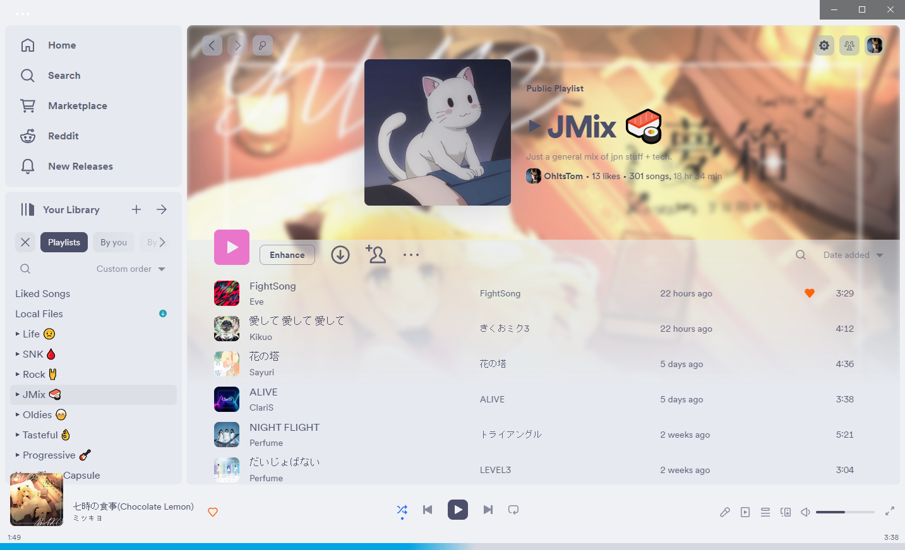

🍨 Frappé

🌺 Macchiato

🌿 Mocha

Rosé Pine

Original

Moon

Dawn

Mono

Original

Forest

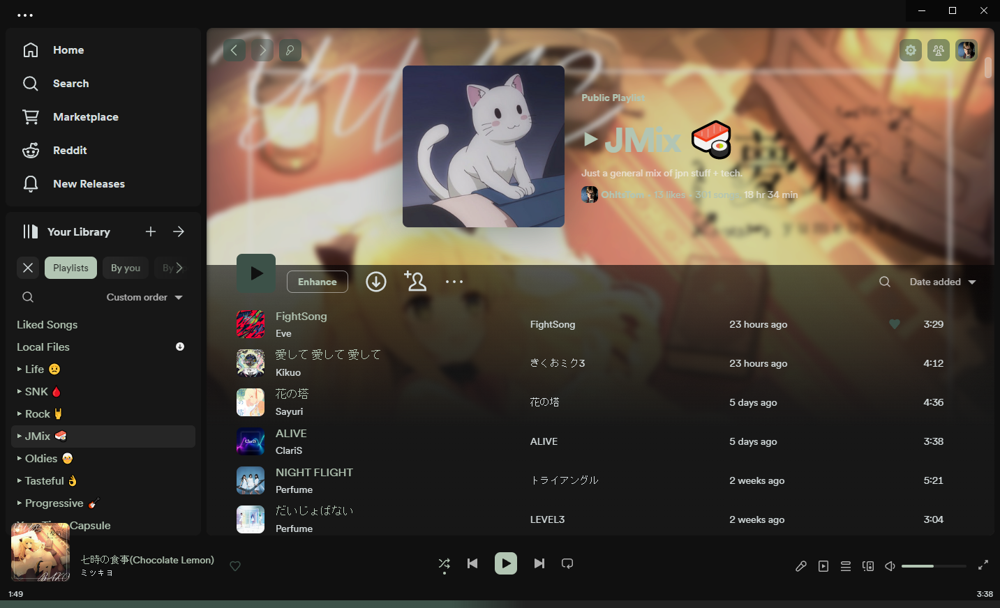

Neon

Sakura

Sunset

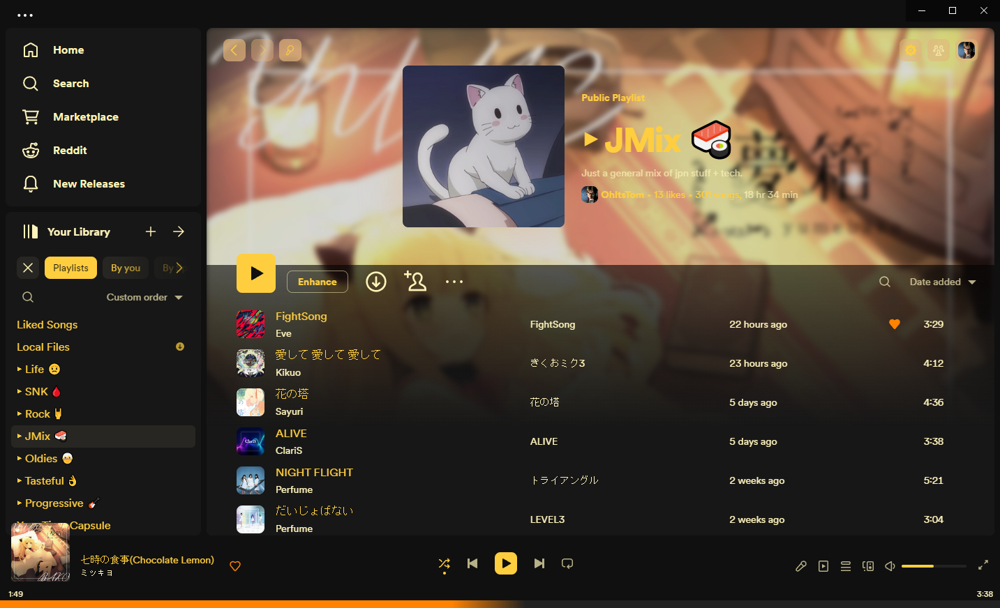

Vaporwave

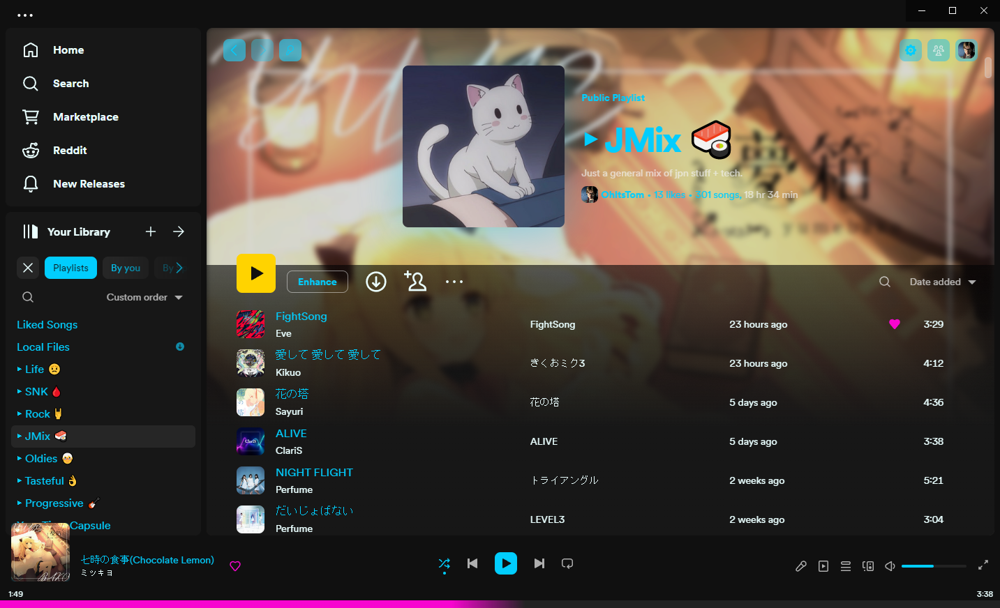

#### Individual

Comfy

Spotify

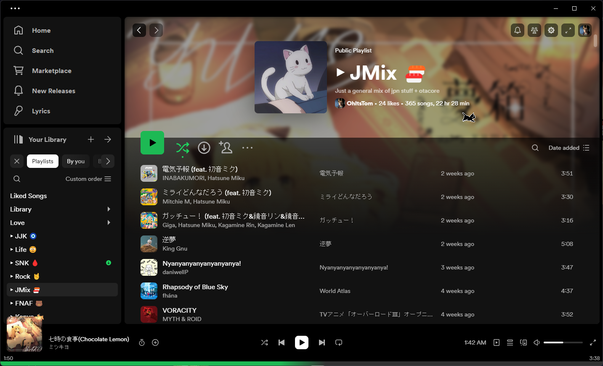

Nord

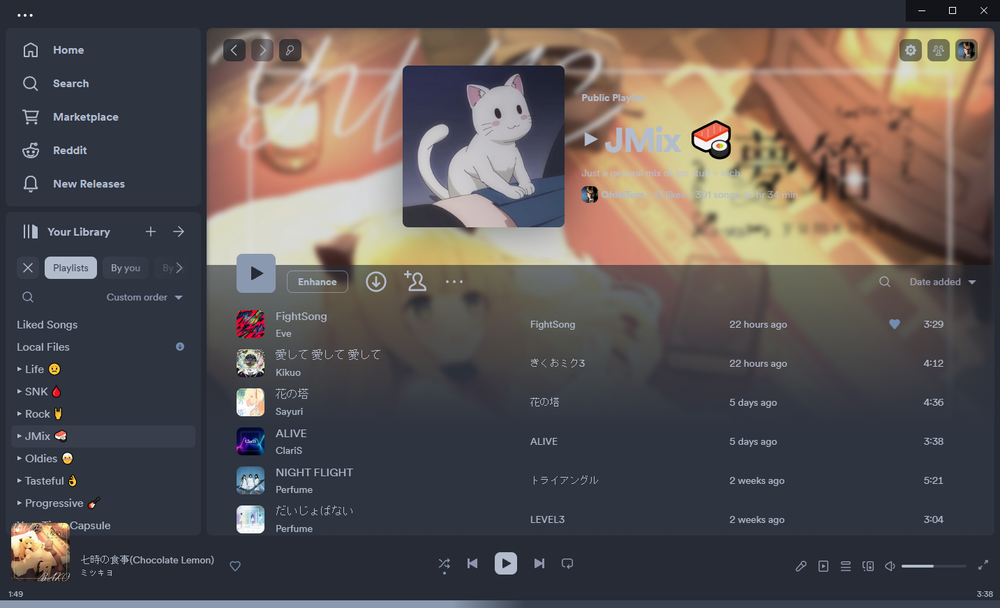

Everforest

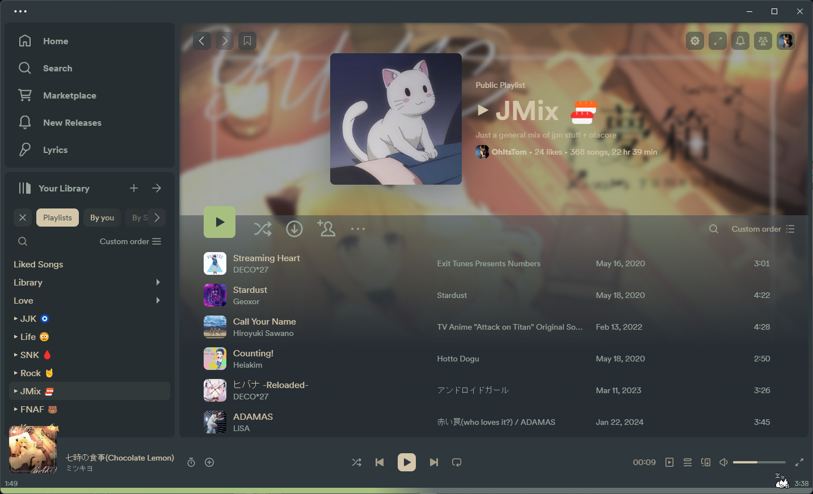

Kanagawa

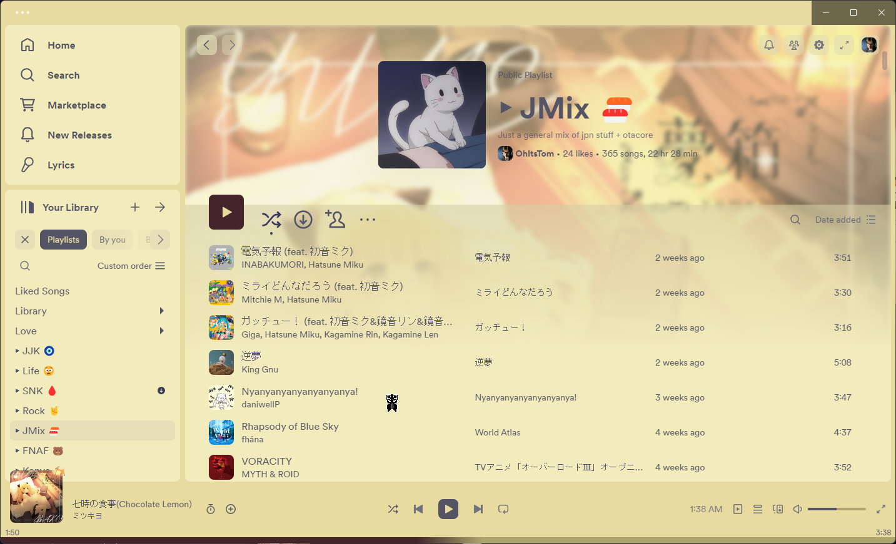

Houjicha

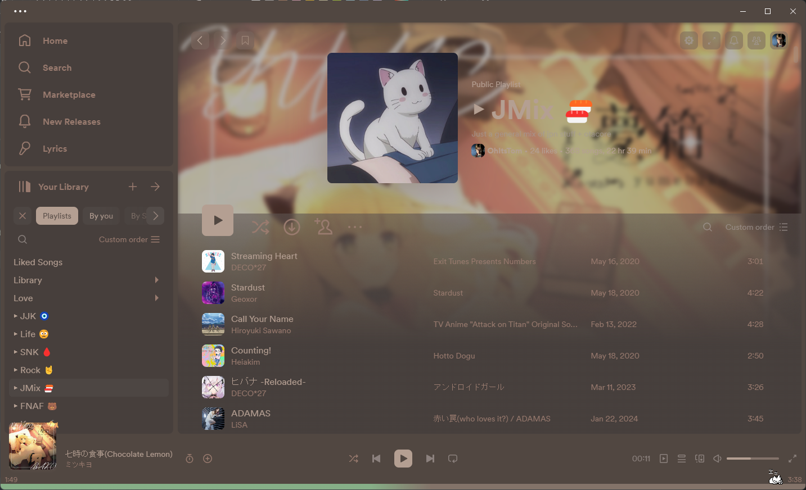

Kitty

Lunar

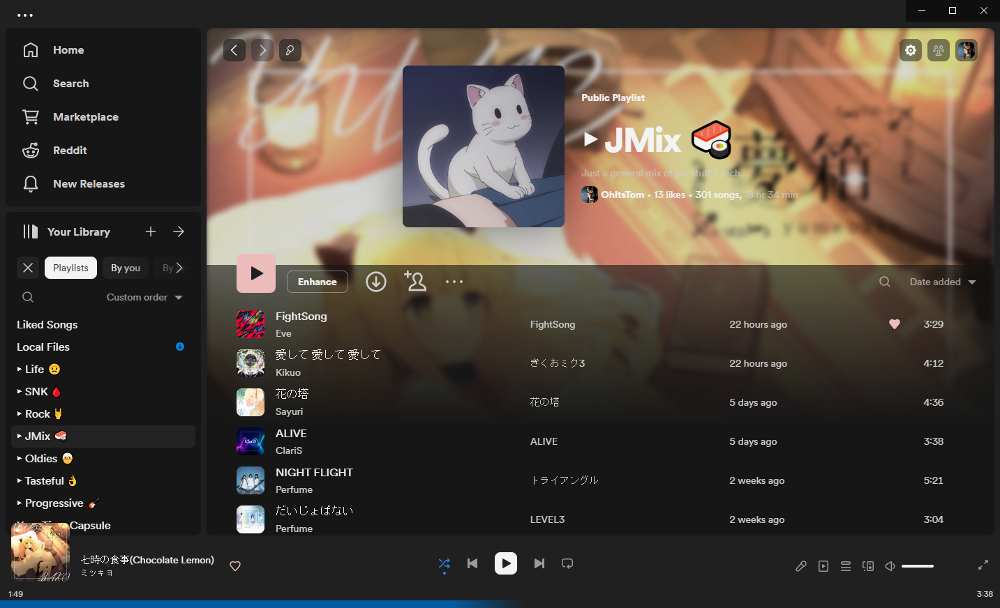

Deep

Velvet

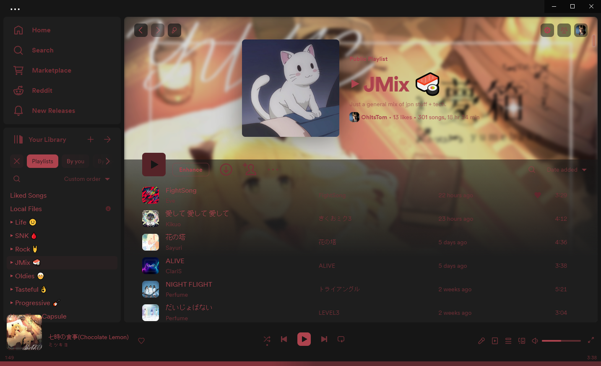

Yami

Hikari

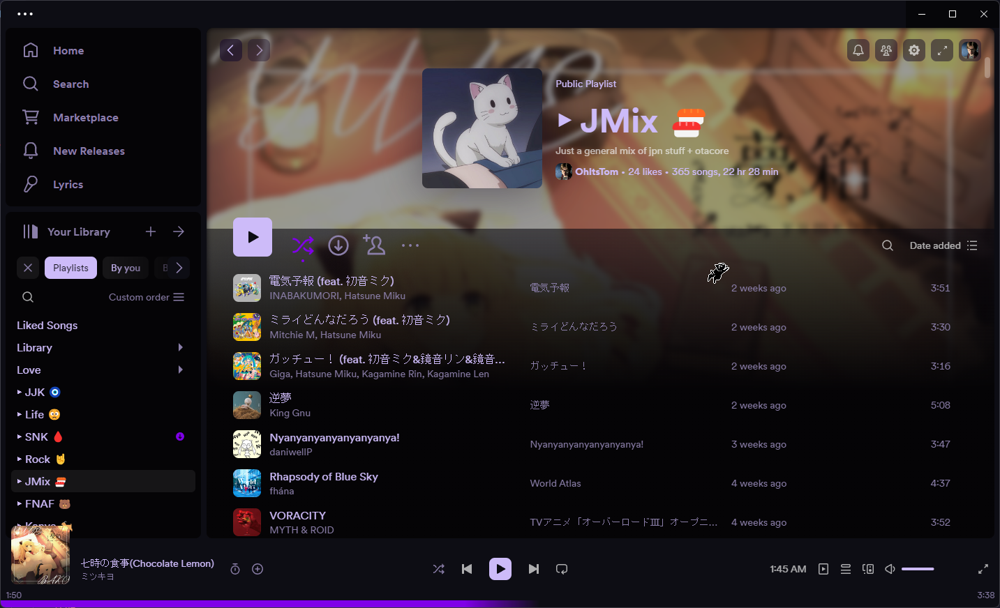

### 📑 Pages

Album

Artist

Browse

Discography

Home

Lyrics Plus

Marketplace

New Releases

Playlist

Podcasts

Profile

Radio

Search

Search Results

### 📳 Panels

Friends

Library

Library Expanded

Library Closed

Library Compact

Now Playing View

Queue

### ⚙️ Settings

Apple Music Gradient

Application Title

Blur

Button Radius

Custom Image

Flatten Colors

Horizontal Page Links

Oblong Cover Art

Topbar in Titlebar

